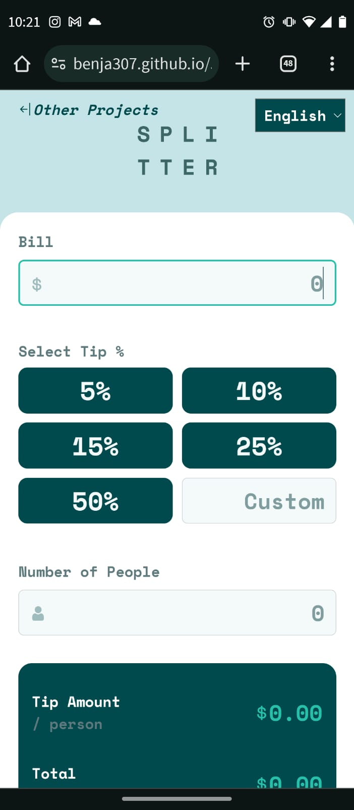

# Frontend Mentor - Tip calculator app solution

This is a solution to the [Tip calculator app challenge on Frontend Mentor](https://www.frontendmentor.io/challenges/tip-calculator-app-ugJNGbJUX). Frontend Mentor challenges help you improve your coding skills by building realistic projects.

## Table of contents

- [Overview](#overview)
  - [The challenge](#the-challenge)
  - [Screenshot](#screenshot)
  - [Links](#links)
- [My process](#my-process)
  - [Built with](#built-with)
  - [What I learned](#what-i-learned)
  - [Continued development](#continued-development)
  - [Useful resources](#useful-resources)
- [Author](#author)
- [Acknowledgments](#acknowledgments)

## Overview

### The challenge

Users should be able to:

- View the optimal layout for the app depending on their device's screen size
- See hover states for all interactive elements on the page
- Calculate the correct tip and total cost of the bill per person

### Screenshot




### Links

- Live Site URL: [Add live site URL here](https://benja307.github.io/5-challenge-frontendmentor/)

## My process

### Built with

- Semantic HTML5 markup
- CSS custom properties
- Flexbox
- CSS Grid
- Sass
- Bootstrap
- Javascript


### What I learned

I'm improving my skills with js. It caused a problem for me at first when I wanted to hit enter to enter the data, the page reloaded and I didn't understand why.
I was able to solve it by adding the following line of code within the corresponding addEventListener.

To see how you can add code snippets, see below:

```js
  e.preventDefault();
```

### Continued development

I will continue improving and discovering js with increasingly entertaining projects.
## Author

- Frontend Mentor - https://www.frontendmentor.io/profile/Benja307
- LinkedIn - https://www.linkedin.com/in/benjamin-corujo-alanis/
- Instagram - @corujobenja_30